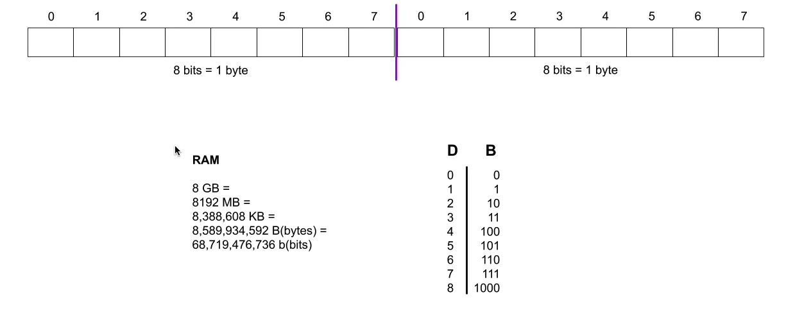

# About this certf

## 1. What is Data Analysis

> A process of **inspecting, cleansing, transforming** and modeling data with the goal of discovering useful information, informing conclusion and supporting decision-making.

The data analysis process :

## 2. Real example Data Analysis with 

- What's data frame ?
It's a special word, data structure that we use in the pandas tool.

- Data Analysis Example :
    - *df.head()* by default let us see the first 5 lignes of our dataset
    - *df.shape* tell us how many rows and columns we have
    - *df.info()* to quickly understand the data we are working with, it help us to have a better structure of our data
    - *df.describe()* to have a statistical understanding of our data, it help us to have a quick statistical view of our data
    - *df.corr()* to fastly get the correlation between properties
    - *df.loc[]* to make a selection using rows or columns name

- Notes taked while doing the Exercice 1 :
    - when *.mean()* is applied on the whole dataset it return multiple value for each numerical column
    - there is a multiple way to get a mean of specific column *describe()* and *.mean()* maybe there is another way, i only know these two

    The *.plot* method in pandas can be used to draw multiple type of graph by setting the type with the **kind** parameter :

       - "line" : for temporal evolution
       - "bar" : to compare multiple categories
       - "hist" : for frequency
       - "box" : for quantiles visualization and aberants values
       - "scatter(x, y)" : to get the relation between two variables
       - "kde" : density estimation

    Use it like this :
    - df.plot(kind="hist")
    - df.plot.hist()

    Also *.plot()* his usefull parameter :
    - figsize(width, heigth) : to set the size of the picture 
    - title="" : add a title
    - legend=True/False : hide or display the legend
    - subplots=True : to let pandas create multiple graph for each column
    - color=['gree', 'red', 'yellow'] : to choise your own color

    *.value_counts()* permet de compter le nombre d'apparitions de chaque valeur unique dans une colonne.

## 3. How to use Jupyter Notebooks

### Note

We have jupyter notebook and jupyter lab and known that jupyter lab is just an evolution of jupyter notebook.
notebooks.ai it's free tool that let you use juyter in the cloud.

Jupyter notebook : sequence of steps, everything append with a cell. Inside a cell, we can write Markdown, R, Julia, Python and a lot more other language by installing their kernel on the computer.

Usefull command in jupyter :
- A : add a new cell above the selected one
- B : add a new cell below the selected one
- M : convert a selected cell to Markdown
- Y : convert to code
- ctrl + Enter : run the code in the selected cell shift + Enter also do the same

> Note: to see your keyboard shortcuts in vscode you can do : ctrl + k & ctrl + s. You can customize it as you want.

#### Why jupyter notebook ??
It make that data analysis extremly ease, as data analyst it's usefull and very important for us to visualize thing.  
For that we use `matplotlib` we can use it directly without leaving our notebook ;)

#### Bokeh
With `Bokeh` we can have dynamic plots, intead of a static one like with `matplotlib` directly in the notebook.
More about it [there](https://docs.bokeh.org/en/latest/docs/first_steps.html) !

4. Intro to NumPy

### Note

Numpy == Numerical Python

Why Numpy is better ? 

5. Intro to Pandas
6. Data Cleaning
7. Reading Data SQL, CSVs, APTs, etc
8. Python in Under 10 Minutes